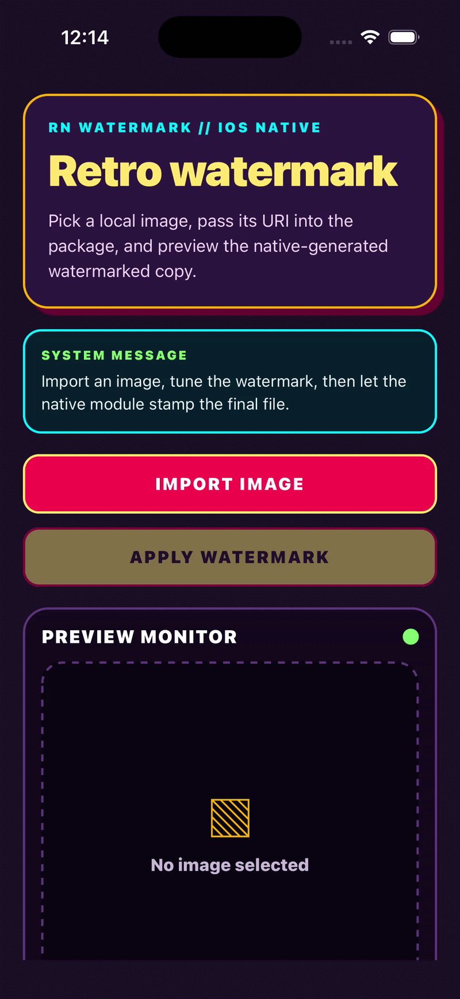

# retro-watermark 🕶️

```
╔══════════════════════════════════════╗
║  RETRO WATERMARK                     ║
║  headless watermark generator for RN ║
╚══════════════════════════════════════╝
```

`retro-watermark` is the first headless watermark generator for React Native 🚀:
it stamps text onto a local image through native Android and iOS renderers, then
returns a newly written image URI back to JavaScript without mounting a visible
watermark view.

## ✨ Key Points

- 🥇 First headless watermark generator built for React Native image workflows.
- 👻 No visible overlay, screenshot capture, or attached native view is required.
- 🖼️ Generates a real watermarked image file that can be previewed, uploaded, or
  saved.
- ⚡ Runs native bitmap rendering on Android and native image rendering on iOS.

## 🎬 Demo

```
╔═══════════════╗
║  FIELD TESTS  ║
╚═══════════════╝
```

| Android | iOS |
| --- | --- |
|  |  |

It ships native implementations for:

- Android: Kotlin bitmap rendering
- iOS: Objective-C image rendering

No React or React Native version is pinned in `peerDependencies`; both are
declared as `"*"`, so consuming apps can choose their own React Native version.

## 📦 Install

```sh
npm install retro-watermark
```

Then rebuild the native app so React Native autolinking can register the native
module:

```sh
# Android
npx react-native run-android

# iOS
cd ios
pod install
cd ..
npx react-native run-ios
```

## 📁 What gets packed for npm

The package includes the files needed by consuming apps:

- `index.js`
- `index.d.ts`
- `react-native.config.js`
- `retro-watermark.podspec`
- `android/build.gradle`
- `android/src/**`
- `demo/**`
- `ios/**`
- `README.md`
- `LICENSE`

## 🧪 Usage

```ts
import { inspectLocalImage } from 'retro-watermark';

const result = await inspectLocalImage({
  localUri: imageUri,
  text: 'CONFIDENTIAL',
  position: 'top-center',
  rotateDegree: 0,
  fontSize: 48,
  colorCode: '#FF004D',
  margins: {
    top: 10,
    right: 20,
    bottom: 30,
    left: 40,
  },
});

console.log(result.uri);      // final watermarked image URI
console.log(result.fileName); // generated file name
console.log(result.width);
console.log(result.height);
```

## API

```ts
inspectLocalImage({
  localUri: string,
  text: string,
  position?: WatermarkPosition,
  rotateDegree?: number,
  fontSize?: number,
  colorCode?: string,
  margins?: WatermarkMargins,
}): Promise<LocalImageDimensions>
```

`inspectLocalImage` accepts a single options object. Only `localUri` and `text`
are required; every other field is optional and receives a native default.

Defaults:

- `position`: `'top-center'`
- `rotateDegree`: `0`
- `fontSize`: `7%` of the smaller image side
- `colorCode`: `'#FFFFFF'`
- `margins`: `{ top: 0, right: 0, bottom: 0, left: 0 }`

### `localUri`

Readable local image URI or local file path.

Android accepts readable `file://` and `content://` URIs. iOS accepts readable
local `file://` URIs, such as images copied into the app sandbox by an image
picker.

### `text`

Watermark text to draw onto the image. Empty or whitespace-only text is rejected.

### `position`

```ts
type WatermarkPosition =
  | 'top-left'
  | 'top-center'
  | 'top-right'
  | 'center-left'
  | 'center'
  | 'center-right'
  | 'bottom-left'
  | 'bottom-center'
  | 'bottom-right';
```

### `colorCode`

Accepts:

- `#RGB`
- `#ARGB`
- `#RRGGBB`
- `#AARRGGBB`

Default: `#FFFFFF`

### `fontSize`

```ts
fontSize?: number;
```

Font size is measured in image pixels. If omitted, the native renderer uses
`7%` of the smaller image side.

The renderer may scale the text down when needed so the rotated watermark still
fits inside the output image.

### `margins`

```ts
type WatermarkMargins = {
  top?: number;
  right?: number;
  bottom?: number;
  left?: number;
};
```

Every margin defaults to `0`.

Edge positions use their matching margin as an inset. Center positions use:

- horizontal offset: `left - right`
- vertical offset: `top - bottom`

The native code clamps placement so the text remains inside the image.

## Native behavior

The native module:

1. Validates the local URI.
2. Checks file/read access.
3. Decodes the image.
4. Applies default options for position, rotation, font size, color, and margins.
5. Draws the text watermark at native level.
6. Writes a new image with a generated file name.
7. Returns the new image URI, source URI, file name, width, and height.

Android accepts readable `file://` and `content://` URIs.

iOS accepts readable local `file://` URIs, such as images copied into the app
sandbox by an image picker.

## Error codes

The promise can reject with:

- `E_IMAGE_NOT_FOUND`
- `E_INVALID_URI`
- `E_UNSUPPORTED_URI`
- `E_PERMISSION_DENIED`
- `E_IMAGE_READ_FAILED`
- `E_INVALID_TEXT`
- `E_INVALID_POSITION`
- `E_INVALID_COLOR`
- `E_INVALID_MARGIN`
- `E_INVALID_IMAGE`
- `E_IMAGE_PROCESSING`

## Changelog

Version `1.1.0` includes a major API change: `inspectLocalImage` now accepts a
single options object instead of positional parameters. See
[`CHANGELOG.md`](./CHANGELOG.md) for migration details.

## Local sample

A bare React Native sample app lives in [`sample`](./sample).

```sh
cd sample
npm install
npm start
npm run android
npm run ios
```

The sample imports `retro-watermark` with `"file:.."`, lets you choose an image,
configure text, font size, color, position, rotation, and margins, then preview
the saved native output.

## License

MIT
